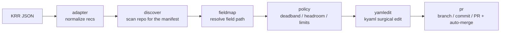

# rere architecture and implementation direction

## Summary

`rere` (ré-ré = **re**source **re**sizer) is the missing *write-back* half of Kubernetes resource right-sizing. Recommenders (Robusta KRR, VPA, Goldilocks) already compute the right CPU/memory requests & limits from history; the gap nobody fills is **safely writing those numbers back into a GitOps repo** — across raw manifests, Helm `values:`, and operator Custom Resources — as clean, auto-merged pull requests. `rere` is a source-available Go CLI + GitHub Action that does exactly that (proprietary; all rights reserved for now — see [ADR-0006](../adrs/0006-proprietary-license.md)). It is **complementary to recommenders**: *keep your recommender, add the write-back half.* See [prior-art.md](prior-art.md) for why the space is otherwise empty.

## The pipeline

Each stage is a single-purpose, independently testable unit:

1. **adapter** — normalizes recommender output to `{ns, kind, name, container, recommended:{requests, limits}}`. Ships a KRR adapter; KRR `-f json` emits raw floats (CPU cores, memory bytes), so the adapter converts to `resource.Quantity` and canonical strings (`250m`, `128Mi`). The schema lets VPA/custom plug in later.
2. **discover** — scans the configured GitOps repo and matches each rec to a manifest by `kind` + `name` (+ `namespace` when present) — no cluster needed, the way Renovate works. Cluster-assisted Flux provenance is a deferred, optional enhancement for disambiguation ([ADR-0003](../adrs/0003-repo-scan-discovery.md)).
3. **fieldmap** — resolves the exact field path(s), tiered (below). Returns paths + values; it does not mutate.
4. **policy** — current vs recommended with a **deadband threshold in both directions** (so tiny deltas, including downsizes, don't churn the repo), headroom multipliers, and a limits policy (mem limit = request; no CPU limit, per KRR's default). Idempotency is the acceptance test: a second run with no metric change produces zero edits.
5. **yamledit** — surgical, comment/order/anchor-preserving, minimal-diff edits via kyaml's `RNode` tree (never whole-doc re-marshal). This is the quality bar — golden-file tested ([ADR-0001](../adrs/0001-go-and-kyaml.md)).
6. **pr** — branch, commit (Git Data API, atomic multi-file), group per workload, open PR, enable auto-merge via the `enablePullRequestAutoMerge` GraphQL mutation. Reads from a local checkout, writes via the GitHub API ([ADR-0004](../adrs/0004-local-checkout-github-api-write.md)).

A thin **cli** layer (cobra, [ADR-0005](../adrs/0005-cobra-cli-framework.md)) orchestrates the pipeline and loads config; `--dry-run` prints a unified diff and opens nothing.

## The three field-map tiers

- **Tier 1** raw Deployment/StatefulSet/DaemonSet → PodSpec path `spec.template.spec.containers[name==X].resources`, **inferred, zero-config**.
- **Tier 2** operator CR → **config-driven** with **built-in maps** (e.g. CNPG `Cluster`, OpenTelemetryCollector). CRD-schema auto-discovery is deferred.
- **Tier 3** HelmRelease `values:` → **per-chart config** with built-in maps for common charts, so most repos need none.

`FieldMapper` is one interface; later tiers slot in without touching callers.

## Scope

- **v1:** Flux + GitHub; all three tiers with built-in maps + user-extensible config; KRR adapter; deadband + coupled transforms; repo-scan discovery (no cluster); auto-merge.
- **Deferred:** cluster-assisted Flux provenance discovery (optional disambiguation), ArgoCD, GitLab/Bitbucket, CRD-OpenAPI schema auto-discovery, `values.schema.json` path discovery, in-cluster controller mode, extra recommender adapters, advanced grouping, and a **GitHub App mode** (install + repo config file, the way Renovate is deployed).

## Why these decisions

The settled decisions and their trade-offs live in the ADRs: Go + kyaml ([ADR-0001](../adrs/0001-go-and-kyaml.md)); standalone, not a Renovate fork ([ADR-0002](../adrs/0002-standalone-not-renovate-fork.md)); repo-scan discovery ([ADR-0003](../adrs/0003-repo-scan-discovery.md)); local-checkout read + GitHub-API write ([ADR-0004](../adrs/0004-local-checkout-github-api-write.md)); cobra for the CLI ([ADR-0005](../adrs/0005-cobra-cli-framework.md)); and a proprietary, all-rights-reserved license for now ([ADR-0006](../adrs/0006-proprietary-license.md)).
